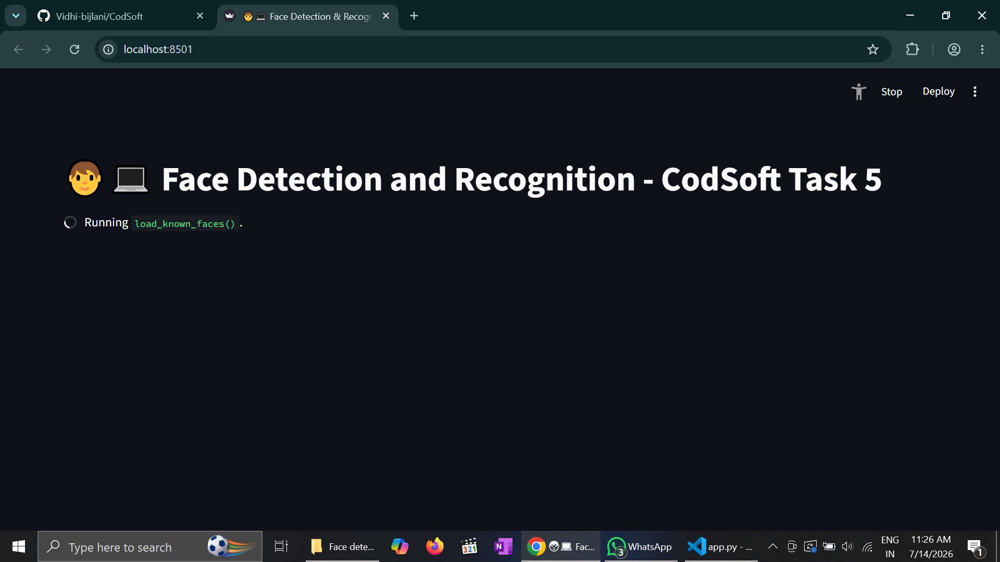
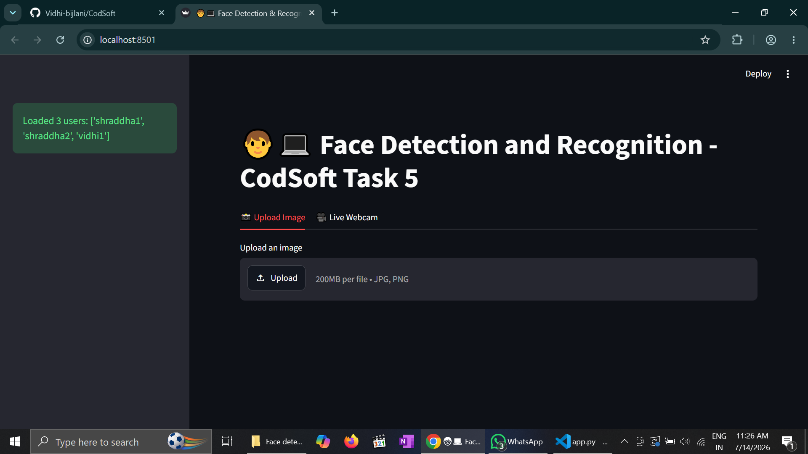
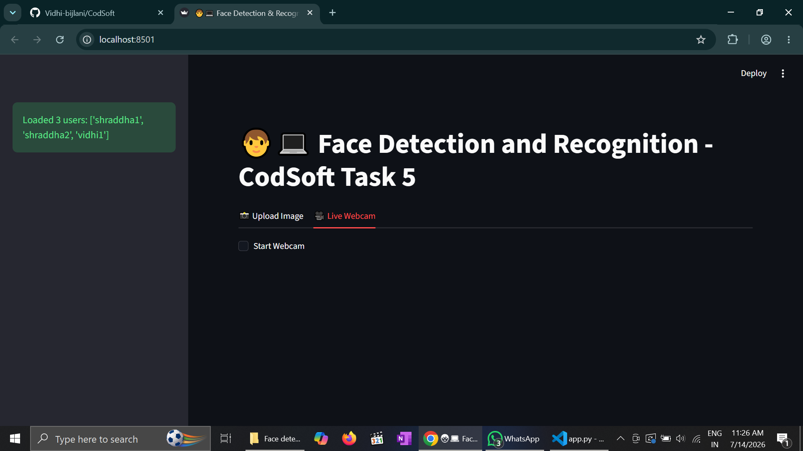
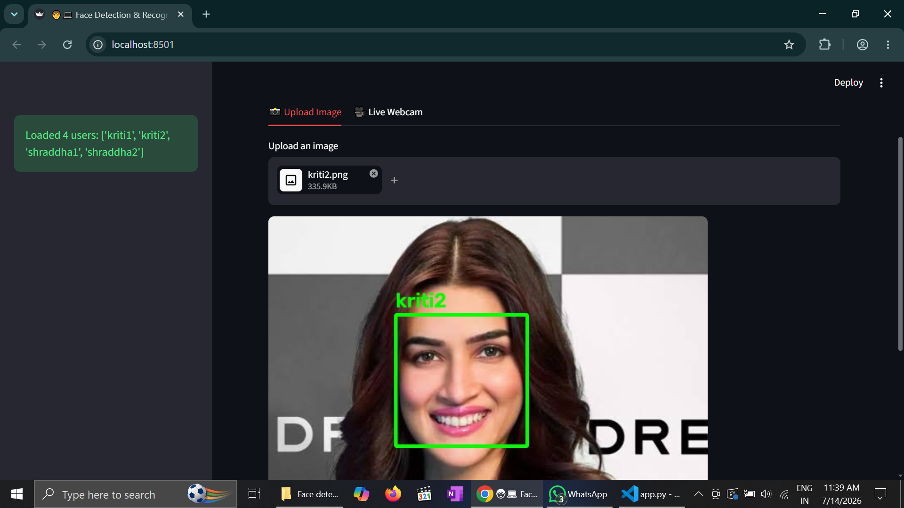
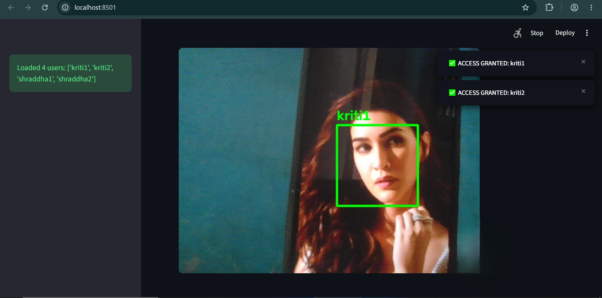

# 🧑‍💻 Face Detection and Recognition - CodSoft Task 5

A real-time AI web app that detects and recognizes faces using `Streamlit` + `OpenCV` + `face_recognition`.  
Also includes basic 🔐 **Access Control System**.

## ✨ Features
- 🎥 **Live Webcam Recognition** - Real-time face detection and recognition
- 📸 **Upload Image** - Upload any image and get instant results
- 👤 **Easy User Management** - Add new users from sidebar, no coding needed
- 🔐 **Access Control** - 🟢 Green Box = Access Granted | 🔴 Red Box = Access Denied
- ⚡ **Optimized** - Fast processing with continuous box tracking
- 📊 **User Log** - Shows "Welcome" toast when known face is detected

## 🛠️ Tech Stack
`Python` `Streamlit` `OpenCV` `dlib` `face-recognition` `Pillow` `NumPy`

## 🚀 How to Run
1. **Install dependencies**
   ```bash
   pip install -r requirements.txt
2. **Run the app**
   ```bash
   streamlit run app.py
   ```

## 📸 Demo

### Loading the website


### Way 1: Upload Image


### Way 2: Live Detection and Recognition


### DEMO 1


### DEMO 2


## 📁 Project Structure
    ## 📁 Project Structure
    CODSOFT_TASK5/
    ├── app.py
    ├── known_faces/
    ├── haarcascade_frontalface_default.xml
    ├── requirements.txt
    └── README.md

    ---
**Developed for: CodSoft Internship 2026**