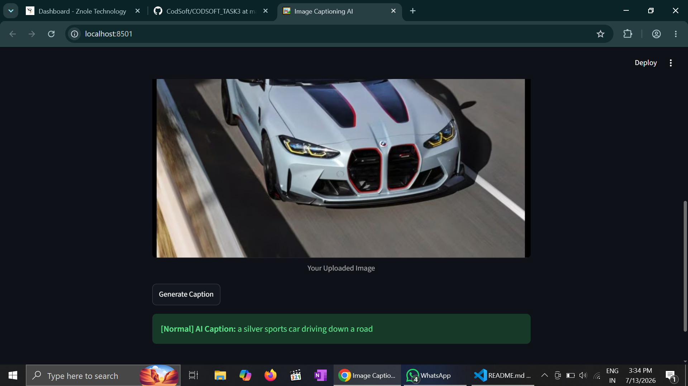
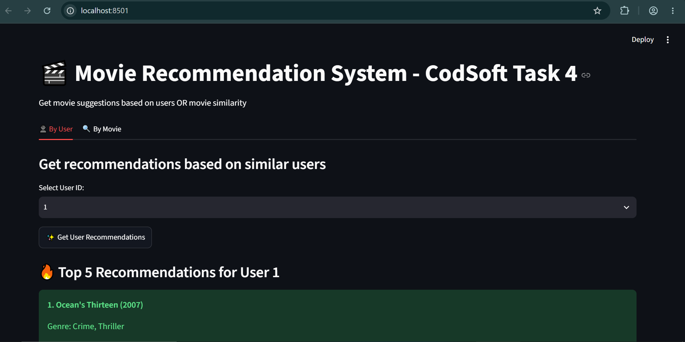
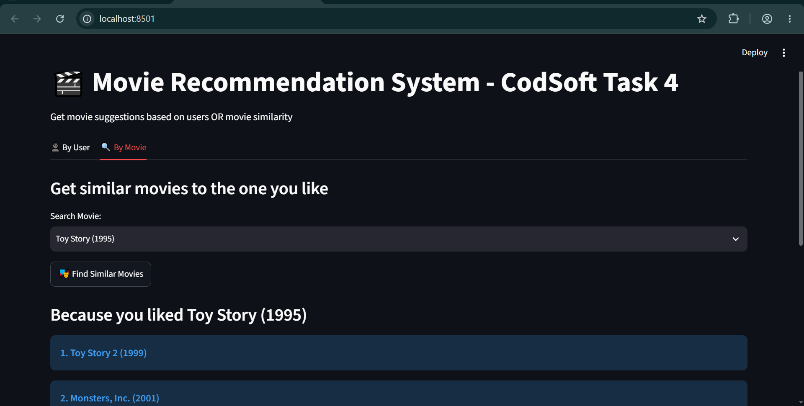

# CodSoft
# 🖼️ Image Captioning AI - CodSoft Task 3

An AI-powered web application that generates smart captions for any uploaded image.  
Built with **Python, Streamlit, and BLIP Transformer Model**.

---

## ✨ Features

- **📤 Upload Any Image**: JPG, JPEG, PNG supported
- **🎭 4 Caption Styles**:
    - **Normal** → Simple and direct description
    - **Detailed** → Rich, descriptive captions
    - **😂 Funny** → Meme-style, car-meet captions 
    - **✨ Poetic** → Beautiful, dramatic descriptions
- **⚡ Fast & Interactive**: Powered by Streamlit for a smooth web experience
- **🧠 AI Model**: Uses `Salesforce/blip-image-captioning-base` from Hugging Face

---

## 🛠️ Tech Stack

- **Language**: Python 3.10+
- **Framework**: Streamlit
- **AI Model**: BLIP - Bootstrapping Language-Image Pre-training
- **Libraries**: `transformers`, `torch`, `Pillow`

---

## 🚀 How to Run Locally

### 1. Clone the repository
```bash
git clone https://github.com/Vidhi-bijlani/CodSoft.git
cd Image-Captioning-AI/CodSoft/Task3
```

## Demo

### Generated caption



# 🎬 Movie Recommendation System - CodSoft Task 4

An AI-powered Hybrid Recommendation System that suggests movies using both Collaborative and Content-Based Filtering.  
Built with **Python, Streamlit, Pandas, and Scikit-learn**.

---

## ✨ Features
- **👤 By User**: Get recommendations based on similar users' preferences
- **🔍 By Movie**: Find movies similar to the one you like based on genres
- **⚡ Fast & Interactive**: Clean Streamlit web interface with 2 tabs
- **📊 Dataset**: MovieLens Dataset - 27,000+ ratings on 9,742 movies

## 🛠️ Tech Stack
`Python` `Streamlit` `Pandas` `Scikit-learn` `Cosine Similarity` `TF-IDF`

## 🚀 How to Run
1. Install dependencies: `pip install streamlit pandas scikit-learn`
2. Run the app: `streamlit run app.py`
3. Open browser at `http://localhost:8501`

## Demo

### 📸 Way 1


### 📸 Way 2

